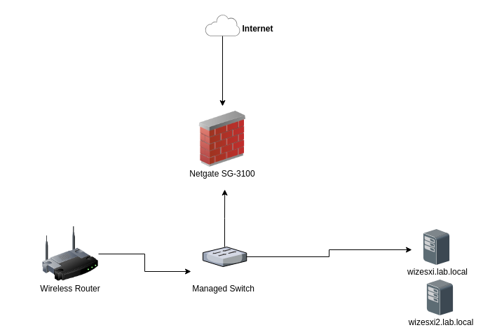

# Lab.Local Information

Information about Lab.Local homelab.

## Environment Overview

### Hosts

| IP Address    | Hostname    | Notes |
|---------------|-------------|-------|
| 192.168.1.15 | TREASURESAVER | Western Digital EX2 NAS       |
| 192.168.1.118 | wizvcenter  | vCenter Server Appliance       |
| 192.168.1.120 | wizesxi     | ESXi Hypervisor       |
| 192.168.1.121 | wizesxi2    | ESXi Hypervisor       |
| 192.168.1.1   | badgergate  | pFsense SG-3100 firewall
| 192.168.1.113 | gs1900      | ZyXEL managed switch|
| 192.168.1.111 | netwitness  | Packet Capture Server       |
| 192.168.1.5   | pihole      | Raspberry Pi DNS server       |
| 192.168.1.11  | graylog     | Graylog Server       |
| 192.168.1.10  | badger-5510 | Ubuntu 18.04 Server       |
| 192.168.1.175 | wizdc1      | Windows Server 2016 Domain Controller       |
| 192.168.1.181 | wizdc2      | Windows Server 2018 Domain Controller       |
| 192.168.1.100 - 192.168.1.200               | Client Device DHCP Scope             |       |
